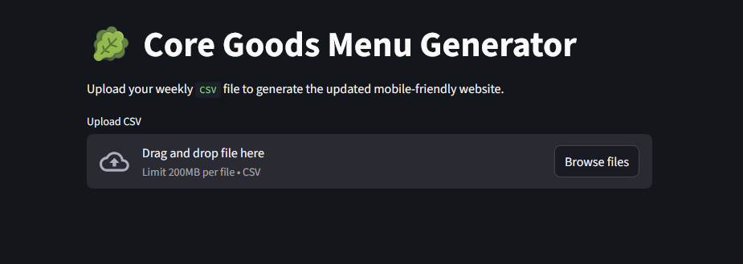
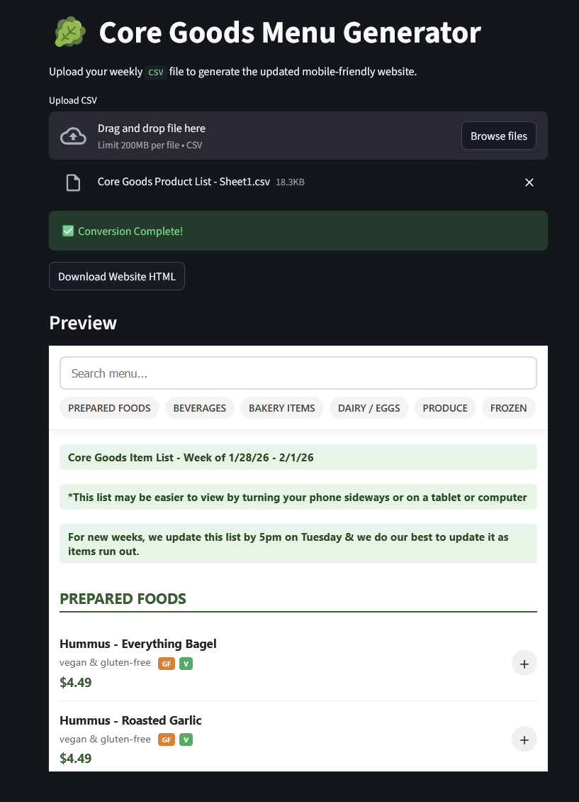

# 🥬 Core Goods Digital Menu Generator

[](https://share.streamlit.io/)


A lightweight automation tool built for **Core Goods** (Oil City, PA) to convert their weekly inventory spreadsheets into a mobile-responsive, interactive shopping application without requiring backend infrastructure.

## 📖 The Problem
Core Goods manages a rotating weekly inventory of hundreds of items. Currently, this list is distributed to customers as a static PDF or spreadsheet image. This presents two friction points:
1.  **User Experience:** Reading a multi-column spreadsheet on a mobile device requires constant zooming and scrolling.
2.  **Ordering Process:** Customers currently have to manually type out their orders in an email, leading to unstructured data and potential errors.

## 🛠 The Solution
This application serves as a **"No-Code" Generator**. The store owner simply uploads their existing CSV file, and the Python script parses the raw data to generate a self-contained HTML file (`core_goods_menu.html`) that functions as a fully interactive web app.

### Key Features
* **Intelligent Parsing:** Automatically detects section headers (e.g., "PRODUCE"), sub-headers (e.g., "Frozen"), and pricing columns, even in messy datasets.
* **Dietary Badges:** Uses Regex to auto-tag items with `[GF]` (Gluten-Free), `[V]` (Vegan), and `[Org]` (Organic) based on description keywords.
* **Instant Search:** Clientside JavaScript allows customers to filter hundreds of items instantly.
* **"No-Backend" Shopping Cart:** Features a JavaScript-based cart that compiles the user's order and generates a pre-formatted email via `mailto`, requiring no server or payment processor integration.
* **Mobile-First Design:** Sticky headers, touch-friendly buttons, and a responsive layout.

## 📸 Screenshots




## ⚙️ How It Works (Technical Breakdown)
This tool leverages **Python** for data processing and **Streamlit** for the user interface.

1.  **Ingestion:** The app accepts a raw `.csv` export of the weekly inventory.
2.  **Processing:**
    * The `csv` library iterates through rows to detect layout changes dynamically.
    * Data cleaning logic handles missing values, price formatting errors, and whitespace.
    * A badge generator maps keywords to CSS styles.
3.  **Generation:** The Python script injects the cleaned data into a pre-built HTML5/CSS3 template containing the JavaScript cart logic.
4.  **Output:** The user downloads a single, portable `.html` file that can be opened in any browser or hosted statically.

## 🧪 Testing Strategy
This project implements a hybrid testing strategy to ensure reliability across both the data parsing logic and the generated frontend.

### Unit Testing (`pytest`)
Verifies the Python logic that parses the messy CSV data.
* **Coverage:** Price extraction regex, bulk threshold detection, dietary badge generation, and junk row filtering.
* **Goal:** Ensure that changes in the CSV format don't break the pricing engine.

### End-to-End Testing (`Playwright`)
Verifies the generated HTML artifact behaves correctly in a real browser.
* **Coverage:**
    * Simulates a user clicking "Add to Cart".
    * Verifies the JavaScript cart math (e.g., ensuring floating point math like `$4.49 + $4.99` doesn't result in `$9.48000001`).
    * Tests the "Search" functionality by typing keystrokes and verifying DOM visibility.
    * Validates the checkout modal flow.

## 🚀 Quick Start

### Running Locally
To run this tool on your own machine:

1.  Clone the repository:
    ```bash
    git clone [https://github.com/yourusername/core-goods-generator.git](https://github.com/yourusername/core-goods-generator.git)
    cd core-goods-generator
    ```

2.  Install dependencies:
    ```bash
    pip install -r requirements.txt
    ```

3.  Run the Streamlit app:
    ```bash
    streamlit run convert_menu.py
    ```

### Usage
1.  Open the web interface.
2.  Drag and drop the weekly `Core Goods Product List.csv`.
3.  Click **Download Website HTML**.
4.  Open the downloaded file in Chrome/Safari to test.

## 📂 Project Structure
* `convert_menu.py`: The main application logic (Streamlit UI + Parsing Engine).
* `tests/`: Contains test_parser_logic.py and test_frontend.py.
* `requirements.txt`: Python dependencies.
* `README.md`: Project documentation.

## 🔮 Future Improvements
* **Saved Preferences:** Use LocalStorage to remember a customer's favorite items.
* **Social Sharing:** Button to share specific items via WhatsApp/SMS.
* **PDF Parsing:** Add support for PDF ingestion using `pdfplumber` for even easier workflow.

---
*Built by Cory Austin as a community automation initiative.*